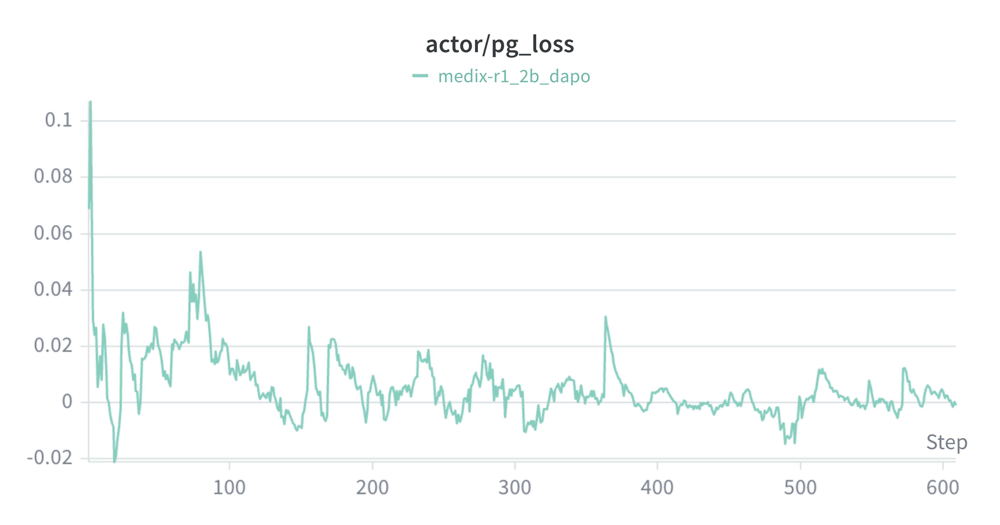
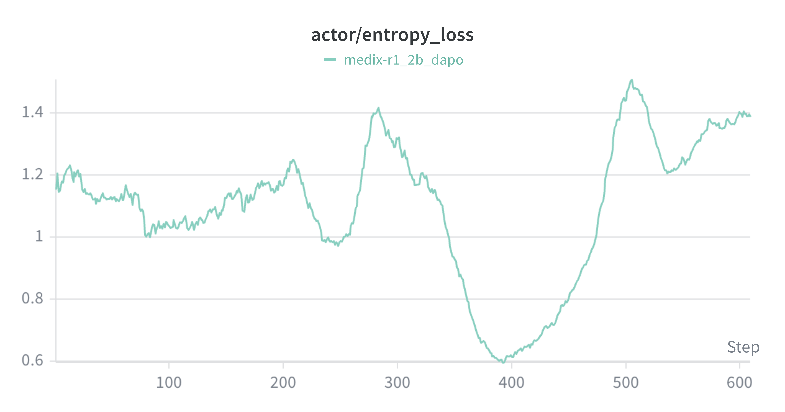
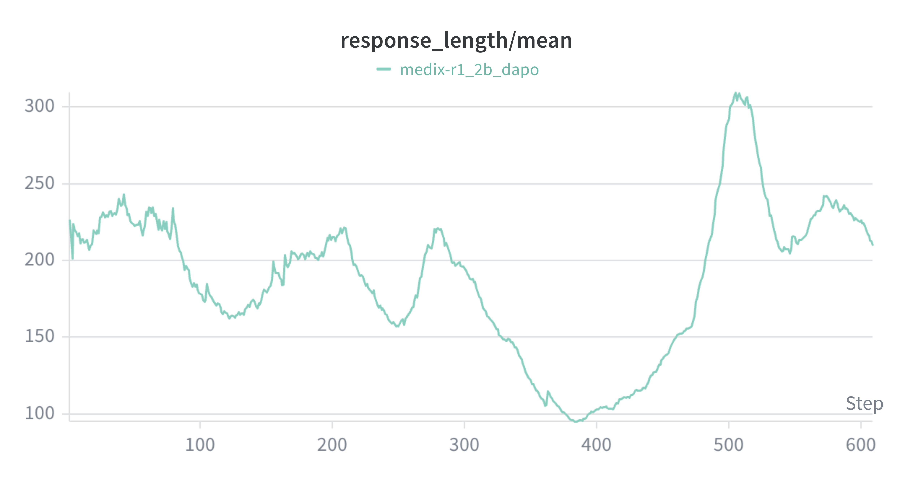
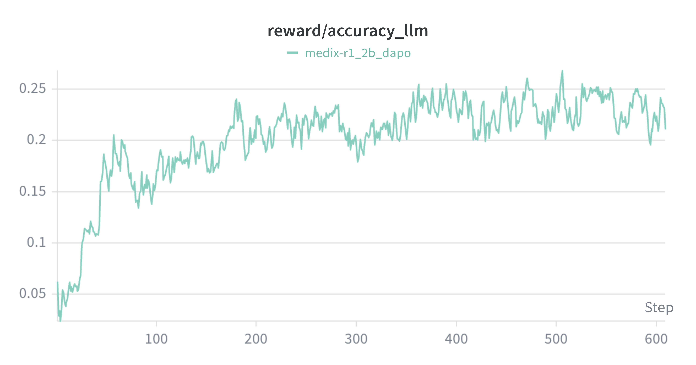
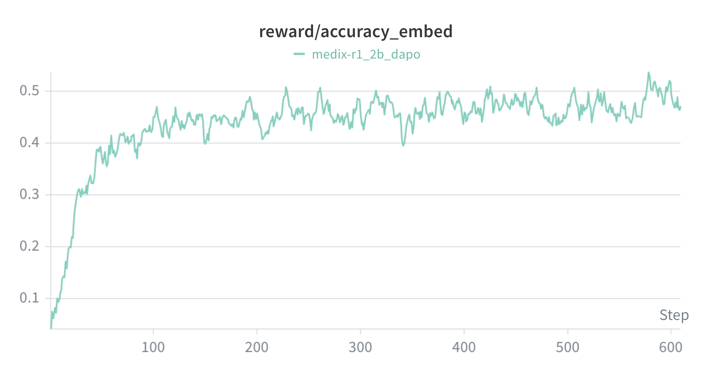
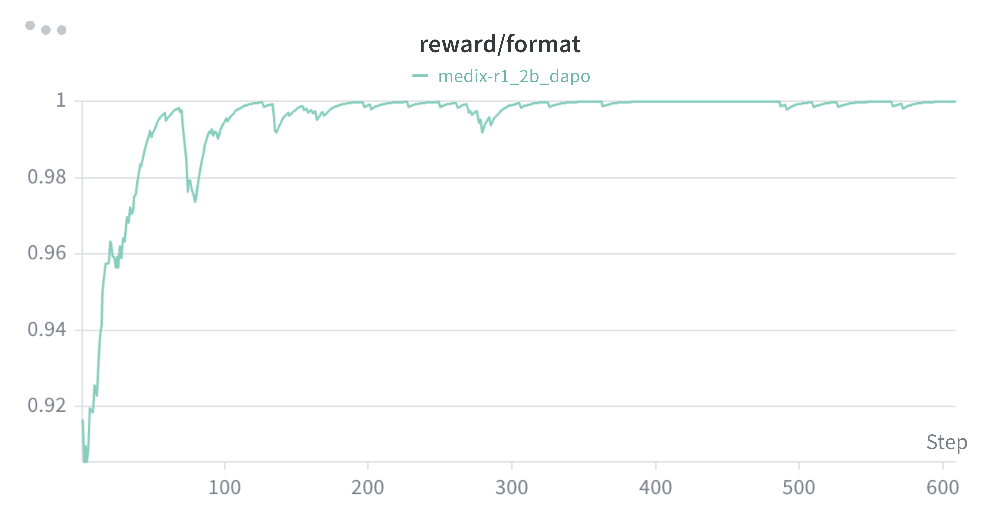
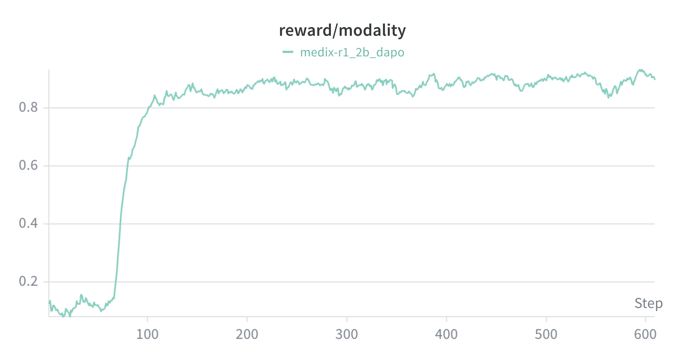
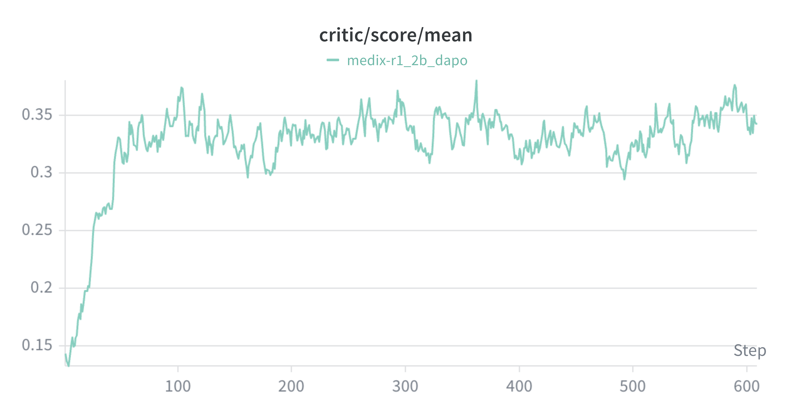

# MediX-R1 2B DAPO 训练指标分析报告

> 实验名称：`medix-r1_2b_dapo`
> 模型：Qwen3-VL-2B-Instruct
> 算法：DAPO 
> 训练步数：~600 steps

---

## 1. 策略梯度损失 (actor/pg_loss)

Policy Gradient Loss 是 DAPO 算法的主损失函数，驱动策略优化的方向。

- **初始阶段 (step 0~50)**：损失从 ~0.10 快速下降，策略在剧烈调整
- **中期 (step 50~300)**：损失在 0~0.03 之间波动，偶有小幅跳升
- **后期 (step 300~600)**：损失趋近于 0 附近，振幅进一步减小

**解读**：pg_loss 从高位收敛到 0 附近是正常且健康的表现 —— 意味着策略更新幅度在缩小，模型逐渐稳定。损失没有出现发散（大幅负值或正值），说明训练过程稳定。

---

## 2. 策略熵 (actor/entropy_loss)

熵反映模型输出的**多样性**，是判断策略是否坍缩的关键信号。

- **初始阶段 (step 0~200)**：熵从 ~1.15 缓慢下降至 ~1.0，属于正常的策略聚焦过程
- **下降阶段 (step 200~400)**：熵出现明显下降，从 ~1.4 急剧跌至 ~0.6，同时伴随响应长度的缩短
- **恢复阶段 (step 400~600)**：熵从 ~0.6 反弹回 ~1.4，恢复到较高水平

**解读**：step 200~400 期间出现了一次**策略坍缩的趋势** —— 模型开始生成更短、更单一的回答（熵下降 + 响应长度缩短）。但 DAPO 的 online filtering 机制和 clip ratio 约束帮助模型在 step 400 后恢复了多样性。这次"V 形"波动值得关注：如果训练继续，需要监控是否会再次出现类似坍缩。

---

## 3. 响应长度 (response_length/mean)

平均响应长度反映模型的输出行为模式变化。

- **初始阶段 (step 0~100)**：长度从 ~220 逐渐下降至 ~165
- **中期下降 (step 200~400)**：长度持续下降至最低 ~95 token
- **后期恢复 (step 400~550)**：长度急剧反弹至 ~305，随后回落稳定在 ~220

**解读**：响应长度的变化趋势与熵曲线高度一致。step 200~400 期间模型倾向于生成更简短的回答（可能是找到了一种"偷懒"策略来获取格式分数），随后通过 DAPO 的自我纠正机制恢复了正常长度。最终稳定在 ~220 token 是合理的。

---

## 4. 奖励分项分析

### 4.1 LLM 准确性奖励 (reward/accuracy_llm)

由大模型评判回答准确性的分数。

- 从初始的 ~0.03 上升至 ~0.22 (step 150)，之后稳定在 0.20~0.25 区间
- 整体呈缓慢上升趋势，后半段略高于前半段

**解读**：LLM 评判的准确性有明确提升，但绝对值仍较低 (~0.22)，说明 2B 模型在医学问答准确性上还有很大提升空间。

### 4.2 嵌入相似度奖励 (reward/accuracy_embed)

模型回答与标准答案在 MedEmbed 嵌入空间中的语义相似度。

- 从 ~0.03 快速上升至 ~0.45 (step 150)，之后稳定在 0.43~0.50 区间
- 上升速度和最终值都高于 LLM 准确性奖励

**解读**：模型更快地学会了生成语义上接近标准答案的回答。这说明模型已具备基本的医学语义理解能力。

### 4.3 格式奖励 (reward/format)

检查回答是否符合 `<think>...</think>` 格式要求。

- 从 ~0.90 迅速上升至 ~1.0 (step 100)，之后几乎保持满分
- 仅在 step ~300 附近有一次微小波动

**解读**：格式遵循是最容易学习的任务，模型在很早期就掌握了正确的输出格式。这个奖励信号已经饱和，不再对策略优化提供有效梯度。

### 4.4 模态匹配奖励 (reward/modality)

检查模型是否正确识别了输入图像的医学模态（如 X-ray、CT、MRI 等）。

- **突变阶段 (step 70~130)**：从 ~0.10 跃升至 ~0.85，出现了一个明显的阶跃
- **稳定阶段 (step 130~600)**：维持在 0.85~0.92 区间

**解读**：模态识别能力出现了"顿悟"式的学习 —— 模型在 step 70~130 突然学会了正确描述图像模态。这种阶跃式学习在 RL 训练中是典型现象，说明模型发现了某种有效的模态识别策略。

### 4.5 综合奖励 (critic/score/mean)

`critic/score/mean` 是每个 rollout batch 中所有样本 `reward/overall` 的**算术平均值**。具体来说，reward function 为每条样本计算一个 `overall` 分数（即上述 4 个分项的加权和），写入 `token_level_scores`；训练框架随后对整个 batch 的 `token_level_scores` 求和再取均值，得到 `critic/score/mean`。因此该指标反映的是模型在**一批数据上的平均综合表现**，而非单条样本的得分。

各分项在 `overall` 中的权重如下（`format_weight=0.1`, `content_weight=0.9`）：

| 分项 | 权重 |
|------|------|
| accuracy_llm | 0.9 × 0.575 = **51.75%** |
| accuracy_embed | 0.9 × 0.375 = **33.75%** |
| format | **10%** |
| modality | 0.9 × 0.05 = **4.5%** |

- **起始阶段 (step 0~100)**：奖励从 ~0.13 快速上升至 ~0.35，模型在训练初期迅速学到基本的回答策略
- **平稳阶段 (step 100~600)**：奖励在 0.30~0.38 区间波动，均值稳定在 ~0.34 附近

**解读**：模型在前 100 步完成了大部分学习，之后进入平台期。奖励没有继续显著上升，说明当前奖励函数的信号可能已被 2B 模型充分利用，或需要更多训练步数/更大模型才能进一步提升。

---
